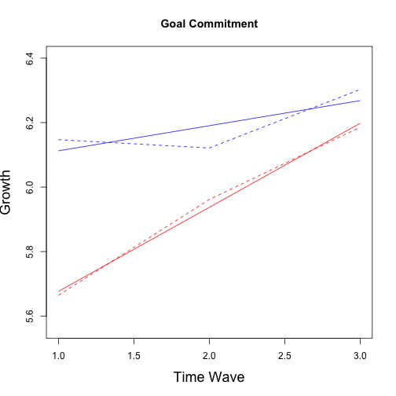
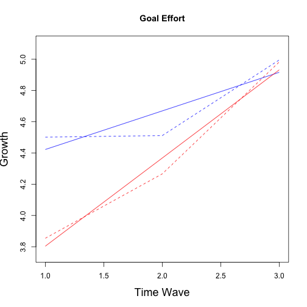
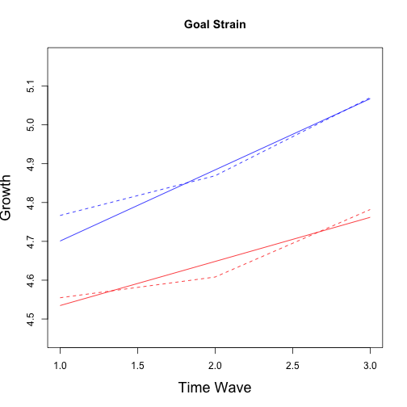

Change in Goal Pursuit Stratergies After High School: Comparison of Alternative Pathways
========================================================
<a name="top"></a>
Contents:

1. [Data Munging](#munging)
2. [Missing Data](#missing)
3. [Goal Scores](#goals) 
4. [Growth Curve: Goal Strain](#goalStrain)
5. [Growth Curve: Goal Commitment](#goalCommit)
6. [Growth Curve: Goal Expectation](#goalExpect)
7. [Growth Curve: Goal Effort](#goalEffort)
8. [Propensity Score Matching](#PSM)
9. [Growth Curve: Matched Goal Strain](#MgoalStrain)
10. [Growth Curve: Matched Goal Commitment](#MgoalCommit)
11. [Growth Curve: Matched Goal Expectation](#MgoalExpect)
12. [Growth Curve: Matched Goal Effort](#MgoalEffort)

<a name="munging"></a>
Data Munging
---------------
Presented below are the following out puts:

1. The non-analysis matching variables used in the propensity score matching model.
2. A table of mean differences in S.D. units and significance levels for the pre-existing differences between direct entry and gap-year participants. *Note.* This does not include school.
3. A table of university entry at year 2 and 3 of the study. *Note.* These table are taken from unimputed data.


```
## Matching Variables:
```

```
##  [1] "id"                                                                                                                               
##  [2] "bsukup6: sex"                                                                                                                     
##  [3] "bsyntvu7: Birth year"                                                                                                             
##  [4] "bkoulu8: School at 2nd measurement"                                                                                               
##  [5] "bka10: Estimate what was your last years grade average (theoretical subjects)"                                                    
##  [6] "bdeci35: because someone else wants it or the situation requires it"                                                              
##  [7] "bdeci36: because I would feel shame, guilt or distress for not fulfilling it"                                                     
##  [8] "Have you done some of the matriculation tests?"                                                                                   
##  [9] "btut104: How important is this goal?"                                                                                             
## [10] "but105: How committed are you to this educational goal?"                                                                          
## [11] "but106:How probable would you say it is that this educational goal will come true?"                                               
## [12] "btut107: How able do you think you are to fulfil your educational goal?"                                                          
## [13] "btut108 Even that the fulfilment of this educational goal would acquire a lot of work, I am going to do everything needed for it."
## [14] "btut109: What ever happens I am not going to give up on this educational goal"                                                    
## [15] "bitsetun: Self-esteem MEAN (bitse127,bkits128,bitse129,bkits130,bitse131)"                                                        
## [16] "buup_pit: Burnout, long, MEAN (buupum85-94)"                                                                                      
## [17] "bdepres: Depression, MEAN (bdeps132-141)"                                                                                         
## [18] "belama: Satisfaction with life, MEAN (belam165-169)"                                                                              
## [19] "boppvai: learning disabilities, MEAN (boppvai81,boppvai82,boppvai83)"                                                             
## [20] "bluoamai: classified mother's occupation"                                                                                         
## [21] "bluoamis: classified father's occupation"
```

```
## Pre-existing differences on matching variables:
```

```
##              Group Diff (SD Units) t_value Significance
## T1importance               0.40390  3.0497            *
## T1commitment               0.57685  4.5987            *
## T1progress                 0.34598  2.8926            *
## T1time                     0.53336  4.8363            *
## T1tiring                   0.14113  1.1737             
## T1cometrue                 0.12254  0.9474             
## T1fulfilgoal               0.28776  2.2282            *
## T1workongoal               0.41724  3.6385            *
## T1stress                   0.32875  2.6645            *
## bsukup6                   -0.82196 -7.0608            *
## bsyntvu7                   0.32301  2.6007            *
## bluoamai                  -0.22598 -1.7624             
## bluoamis                   0.06475  0.5344             
## bdeci35                    0.05183  0.4424             
## bdeci36                    0.05922  0.4986             
## bitsetun                  -0.04371 -0.3752             
## buup_pit                  -0.06885 -0.5842             
## bdepres                    0.02886  0.2527             
## belama                     0.19640  1.7049             
## boppvai                   -0.13996 -1.2505             
## btut104                    0.62508  5.1884            *
## btut105                    0.71244  6.2023            *
## btut106                    0.34952  3.1573            *
## btut107                    0.23635  1.9697            *
## btut108                    0.59124  4.9664            *
## btut109                    0.54712  5.0093            *
## byo95                      0.23042  1.8812             
## bka10                      0.41424  3.5774            *
```

[top](#top)

<a name="missing"></a>
Missing Data
-------------------
To account for missing data five imputation datasets were created using the Amelia II package. A graphical representation of missingness is provided below. As can be seen, while attrition was present it was relatively minor in most cases.

```
#{r missingData, fig.width=7, fig.height=6, message=FALSE, warning=FALSE, echo=FALSE, cache=FALSE}
set.seed(104)
library(Amelia)
MI <- amelia(data2Goals, m = 5, idvars=c("id", "bkou102b", "id.1" , "bk102a_1",
                                         "bk102a_8","bkoulu8", "CKES40_1",   
                                         "dkes36a"),
             noms=c("bsukup6", "byo95"),
             ords = c("bsyntvu7", "dtil37b", "CK37_2")
             )
missmap(MI)
save(MI, file="/Users/phparker/Dropbox/Databases/FinnishData/MI.RData")
rm(MI)
```


```
## Missing datapercentage:
## -----------------------------
```

```
##           id T1importance T1commitment   T1progress       T1time 
##        0.000        0.008        0.008        0.008        0.008 
##     T1tiring   T1cometrue T1fulfilgoal T1workongoal     T1stress 
##        0.010        0.008        0.008        0.010        0.008 
##     bk102a_1     bk102a_8     bkou102b T2importance T2commitment 
##        0.000        0.000        0.000        0.391        0.391 
##   T2progress       T2time     T2tiring   T2cometrue T2fulfilgoal 
##        0.394        0.391        0.391        0.394        0.396 
## T2workongoal     T2stress         id.1 T3importance T3commitment 
##        0.391        0.391        0.354        0.409        0.412 
##   T3progress       T3time     T3tiring   T3cometrue T3fulfilgoal 
##        0.551        0.412        0.409        0.409        0.409 
## T3workongoal     T3stress        group      bkoulu8      bsukup6 
##        0.409        0.409        0.000        0.000        0.000 
##     bsyntvu7     bluoamai     bluoamis      bdeci35      bdeci36 
##        0.000        0.039        0.073        0.008        0.008 
##     bitsetun     buup_pit      bdepres       belama      boppvai 
##        0.003        0.008        0.000        0.008        0.003 
##      btut104      btut105      btut106      btut107      btut108 
##        0.000        0.000        0.000        0.000        0.000 
##      btut109        byo95       CK37_2     CKES40_1      dtil37b 
##        0.000        0.003        0.000        0.769        0.604 
##      dkes36a        bka10         sch1         sch2         sch3 
##        0.404        0.013        0.000        0.000        0.000 
##         sch4         sch5 
##        0.000        0.000
```

[top](#top)


<a name="goals"></a>
Scale Score and Pooling Models
--------------------
Scale scores for the goal cognitions and behaviours were constructed after imputation. For full script, including the pooling functions please contact lead author.


Status
-------------------


```r
library(abind)
dataMIimp <- imputationList(MI$imputations)
# Chi-square tables for unmatched status attainment
cat("First year post univeristy\n============================\n")
```

```
## First year post univeristy
## ============================
```

```r
st1a <- abind(with(dataMIimp, table(CK37_2, group)))
st1b <- with(dataMIimp, chisq.test(CK37_2, group, simulate.p.value = TRUE))
resStat <- as.matrix(cbind(apply(st1a[, c(T, F)], 1, mean), apply(st1a[, c(F, 
    T)], 1, mean)))
dimnames(resStat) <- list(c("Not Entered", "Entered"), c("Gap", "Direct"))
cat("Univeristy enrolment\n------------------\n")
```

```
## Univeristy enrolment
## ------------------
```

```r
resStat
```

```
##             Gap Direct
## Not Entered 196    102
## Entered      81      2
```

```r
resStat <- matrix(rowMeans(sapply(st1b, function(x) x$stdres)), 2, 2)
dimnames(resStat) <- list(c("Not Entered", "Entered"), c("Gap", "Direct"))
cat("Std. residuals: Cell\n------------------\n")
```

```
## Std. residuals: Cell
## ------------------
```

```r
resStat
```

```
##                Gap Direct
## Not Entered -5.755  5.755
## Entered      5.755 -5.755
```

```r
cat("p-value: ", mean(sapply(st1b, function(x) x$p.value)))
```

```
## p-value:  0.0004998
```

```r

cat("Second year post univeristy\n===========================\n")
```

```
## Second year post univeristy
## ===========================
```

```r
st1a <- abind(with(dataMIimp, table(dtil37b, group)))
st1b <- with(dataMIimp, chisq.test(dtil37b, group, simulate.p.value = TRUE))
resStat <- as.matrix(cbind(apply(st1a[, c(T, F)], 1, mean), apply(st1a[, c(F, 
    T)], 1, mean)))
dimnames(resStat) <- list(c("Not Entered", "Entered"), c("Gap", "Direct"))
cat("Univeristy enrolment\n------------------\n")
```

```
## Univeristy enrolment
## ------------------
```

```r
resStat
```

```
##               Gap Direct
## Not Entered  50.4   24.6
## Entered     226.6   79.4
```

```r
resStat <- matrix(rowMeans(sapply(st1b, function(x) x$stdres)), 2, 2)
dimnames(resStat) <- list(c("Not Entered", "Entered"), c("Gap", "Direct"))
cat("Std. residuals: Cell\n------------------\n")
```

```
## Std. residuals: Cell
## ------------------
```

```r
resStat
```

```
##                Gap Direct
## Not Entered -1.193  1.193
## Entered      1.193 -1.193
```

```r
cat("p-value: ", mean(sapply(st1b, function(x) x$p.value)))
```

```
## p-value:  0.3453
```


<a name="goalStrain"></a>
Growth: Goal Strain
---------------------
Growth curve models are fitted using the lmer package and pooled estimated and t-values given by the mitools package. Fitting of these models was the same for all outcomes of interest but the script is given for goal strain below as an illustration. Results for all models follow.


```r
# models
goal.strain <- lapply(MI$imputations, function(x) StackFun("goal.strain", x))
goal.strain <- imputationList(goal.strain)
# Intercept only
M0 <- with(data = goal.strain, lmer(goal.strain ~ group + (1 | id)))
M0_b <- colMeans(do.call(rbind, MIextract(M0, fun = fixef)))
M0_r <- with(data = goal.strain, lmer(I(goal.strain - M0_b[1]) ~ 0 + offset(M0_b[2] * 
    group) + (1 | id)))
# Linear
M1 <- with(data = goal.strain, lmer(goal.strain ~ wave + group + wave:group + 
    (wave | id)))
M1_b <- colMeans(do.call(rbind, MIextract(M1, fun = fixef)))
M1_r <- with(data = goal.strain, lmer(I(goal.strain - M1_b[1]) ~ 0 + offset(M1_b[2] * 
    wave) + offset(M1_b[3] * group) + offset(M1_b[4] * I(group * wave)) + (1 + 
    wave | id)))
# Quadratic
M2 <- with(data = goal.strain, lmer(goal.strain ~ wave + group + wave:group + 
    I(wave^2) + group:I(wave^2) + (wave | id)))
M2_b <- colMeans(do.call(rbind, MIextract(M2, fun = fixef)))
M2_r <- with(data = goal.strain, lmer(I(goal.strain - M2_b[1]) ~ 0 + offset(M2_b[2] * 
    wave) + offset(M2_b[3] * group) + offset(M2_b[5] * I(group * wave)) + offset(M2_b[4] * 
    I(wave * wave)) + offset(M2_b[6] * I(group * wave * wave)) + (1 + wave | 
    id)))
# Compare Models
chi_b <- sapply(1:5, function(x) anova(M0[[x]], M1[[x]], M2[[x]])[2:3, c("Chisq")])
chi_r <- sapply(1:5, function(x) anova(M0_r[[x]], M1_r[[x]], M2_r[[x]])[2:3, 
    c("Chisq")])
cat("No growth vs. Linear\nchi:", mean(chi_r[1, ]), "; df:2; p-value:", Fit_Fun(chi_b[1, 
    ], chi_r[1, ], M = 5, df = 2))
```

```
## No growth vs. Linear
## chi: 19.75 ; df:2; p-value: 0.004477
```

```r
cat("Linear vs. Quadratic\nchi:", mean(chi_r[2, ]), "; df:2; p-value:", Fit_Fun(chi_b[2, 
    ], chi_r[2, ], M = 5, df = 2))
```

```
## Linear vs. Quadratic
## chi: 0.9845 ; df:2; p-value: 0.6983
```

```r
# Parameter Estimates
M_summary <- F_Model_Par(M1)
summary(M_summary)
```

```
## Multiple imputation results:
##       MIcombine.default(betas, vars2)
##             results      se    (lower  upper) missInfo
## (Intercept)  4.7326 0.13166  4.472813 4.99237     16 %
## wave         0.1251 0.05795  0.008215 0.24203     34 %
## group       -0.4709 0.28078 -1.038188 0.09629     35 %
## wave:group   0.0442 0.13449 -0.243616 0.33202     58 %
```

```r
### Plots observed Mean and trend######
MGS1 <- sapply(MI$imputations, function(x) apply(x[x$group == 0, grep("strain$", 
    names(x))], 2, mean, na.rm = TRUE))
MGS1 <- rowMeans(MGS1)
MGS2 <- sapply(MI$imputations, function(x) apply(x[x$group == 1, grep("strain$", 
    names(x))], 2, mean, na.rm = TRUE))
MGS2 <- rowMeans(MGS2)
# Observed Trend
plot(1:3, MGS1, type = "l", lty = 2, col = "blue", ylab = "Growth", xlab = "Years Since Graduation", 
    main = "Goal Strain", ylim = c(min(c(MGS1, MGS2)) - 0.1, max(c(MGS1, MGS2)) + 
        0.1))
points(1:3, MGS2, col = "red", type = "l", lty = 2)
# Fitted Trend
pars <- M_summary$coef
fgs1 <- function(x) {
    pars[1] + (pars[2] * x)
}
curve(fgs1, 1, 3, col = "blue", add = TRUE)
fgs2 <- function(x) {
    (pars[1] + pars[3]) + (pars[2] * x + pars[4] * x)
}
curve(fgs2, 1, 3, col = "red", add = TRUE)
```

 


[top](#top)
  
<a name="goalCommit"></a>
Goal commit
-----------------

```
## No growth vs. Linear
## chi: 59.92 ; df:2; p-value: 1.552e-06
```

```
## Linear vs. Quadratic
## chi: 6.088 ; df:2; p-value: 0.2028
```

```
## Multiple imputation results:
##       MIcombine.default(betas, vars2)
##              results      se   (lower  upper) missInfo
## (Intercept)  6.03460 0.09383  5.84323  6.2260     40 %
## wave         0.07789 0.04633 -0.02147  0.1773     59 %
## group       -0.61878 0.15985 -0.93557 -0.3020     21 %
## wave:group   0.18281 0.08015  0.01643  0.3492     48 %
```

 

[top](#top)

<a name="goalExpect"></a>
Goal Expectations
--------------

```
## No growth vs. Linear
## chi: 81.5 ; df:2; p-value: 2.116e-09
```

```
## Linear vs. Quadratic
## chi: 4.825 ; df:2; p-value: 0.2802
```

```
## Multiple imputation results:
##       MIcombine.default(betas, vars2)
##             results      se   (lower  upper) missInfo
## (Intercept)  5.1720 0.10583  4.96071 5.38321     27 %
## wave         0.2317 0.05163  0.12365 0.33974     51 %
## group       -0.3594 0.21390 -0.79222 0.07347     36 %
## wave:group   0.1550 0.11342 -0.09319 0.40322     65 %
```

 

[top](#top)

<a name="goalEffort"></a>
Goal Effort
------------

```
## No growth vs. Linear
## chi: 80.04 ; df:2; p-value: 2.706e-10
```

```
## Linear vs. Quadratic
## chi: 9.963 ; df:2; p-value: 0.08415
```

```
## Multiple imputation results:
##       MIcombine.default(betas, vars2)
##             results      se  (lower  upper) missInfo
## (Intercept)  4.1753 0.12817  3.9184  4.4323     30 %
## wave         0.2468 0.06622  0.1084  0.3853     51 %
## group       -0.9355 0.22773 -1.3852 -0.4859     17 %
## wave:group   0.3170 0.11642  0.0798  0.5543     39 %
```

 

[top](#top)

<a name="PSM"></a>
Propensity Score Matching
------------
Multilevel Propensity score matching was conducted using the following approach. Note that we take a sample specific not a population inference approach to matching data and thus slightly difference distance models are present for each of the 5 imputed datasets. Helper functions for the MatchIt package are taken from AUTHOR website.


```r
library(snowfall)
set.seed(100)
MData <- list()
for (i in 1:5) {
    MData[[i]] <- na.omit(MI$imputations[[i]][, -c(23, 34, 54, 56)])
}
forM <- paste("group ~ ", paste0(names(MData[[1]])[-c(1:32, 51:52, 54:58, 63:68)], 
    collapse = " + "))
forM <- paste0(forM, " + I(bluoamis*bluoamis)")
cat("Matching equation used was:\n", forM)
```

```
## Matching equation used was:
##  group ~  bsukup6 + bsyntvu7 + bluoamai + bluoamis + bdeci35 + bdeci36 + bitsetun + buup_pit + bdepres + belama + boppvai + btut104 + btut105 + btut106 + btut107 + btut108 + btut109 + byo95 + bka10 + T1goal.strain + T1goal.commit + T1goal.expect + T1goal.effort + T3goal.expect + T3goal.effort + I(bluoamis*bluoamis)
```

```r
sfInit(parallel = TRUE, cpus = 5)
```

```
## R Version:  R version 3.0.2 (2013-09-25)
```

```r
# exports amelia library to all the clusters
sfLibrary(MatchIt)
```

```
## Library MatchIt loaded.
```

```r
# export any object you want each of the clusters to have access to
sfExport("MData")
sfExport("forM")
# wrap what you want parallel in a function
model <- sfLapply(MData, function(x) {
    set.seed(37)
    matchit(as.formula(forM), data = x, method = "nearest", discard = "both", 
        caliper = 0.2, ratio = 3, distance = "logit", distance.options = list(maxit = 100))
})
model2 <- sfLapply(MData, function(x) {
    set.seed(37)
    matchit(as.formula(forM), data = x, method = "nearest", discard = "both", 
        caliper = 0.2, ratio = 1, distance = "logit", distance.options = list(maxit = 100))
})
sfExport("model")
MIdata <- sfLapply(model, function(x) {
    set.seed(37)
    summary(x, addlvariables = NULL, interactions = TRUE, standardize = TRUE)
})
sfStop()
cat("Largest cohen's d differences for each imputation:\n---------------------------------------------")
```

```
## Largest cohen's d differences for each imputation:
## ---------------------------------------------
```

```r
sapply(MIdata, function(x) head(meandifftable(x)))
```

```
## $m_mean_diff
## [1] -0.1798 -0.1629  0.1607 -0.1560 -0.1539  0.1497
## 
## $m_mean_diff
## [1]  0.1934  0.1537  0.1480  0.1469 -0.1460  0.1459
## 
## $m_mean_diff
## [1] -0.1897  0.1625 -0.1580 -0.1558  0.1524 -0.1494
## 
## $m_mean_diff
## [1] -0.1673  0.1634 -0.1630  0.1550 -0.1517 -0.1513
## 
## $m_mean_diff
## [1] -0.2227 -0.1848 -0.1738 -0.1725  0.1715 -0.1698
```

```r
cat("Plot of mean differences pre and post matching\n")
```

```
## Plot of mean differences pre and post matching
```

```r
library(gridExtra)
library(plyr)
plot1 <- all_meandiffplot(MIdata[[1]])
plot2 <- matched_meandiffplot(MIdata[[1]])
grid.arrange(plot1, plot2, ncol = 2)
```

 

```r
cat("cohen's d differences pre-matching:\n")
```

```
## cohen's d differences pre-matching:
```

```r
rowMeans(sapply(MIdata, all_meandiffcount))
```

```
##  Large Medium  Small 
##  213.6   35.2  156.2
```

```r
cat("cohen's d differences post-matching:\n")
```

```
## cohen's d differences post-matching:
```

```r
sapply(MIdata, matched_meandiffcount)
```

```
## [[1]]
## 
## Small 
##   405 
## 
## [[2]]
## 
## Small 
##   405 
## 
## [[3]]
## 
## Small 
##   405 
## 
## [[4]]
## 
## Small 
##   405 
## 
## [[5]]
## 
## Medium  Small 
##      1    404
```

```r
# save matched data with weights
dmatch <- lapply(model, match.data)
cat("Total sample size: ", mean(sapply(dmatch, nrow)))
```

```
## Total sample size:  225.8
```

```r
cat("Group sample size:\n", rowMeans(sapply(dmatch, function(x) table(x$group))))
```

```
## Group sample size:
##  143.4 82.4
```

```r
dmatch2 <- lapply(model2, match.data)
```


Status
-------------------


```
## First year post univeristy
## ============================
```

```
## Univeristy enrolment
## ------------------
```

```
##              Gap Direct
## Not Entered 61.2   80.4
## Entered     21.2    2.0
```

```
## Std. residuals: Cell
## ------------------
```

```
##               Gap Direct
## Not Entered -4.28   4.28
## Entered      4.28  -4.28
```

```
## p-value:  0.0008996
```

```
## Second year post univeristy
## ============================
```

```
## Univeristy enrolment
## ------------------
```

```
##              Gap Direct
## Not Entered 20.6   18.8
## Entered     61.8   63.6
```

```
## Std. residuals: Cell
## ------------------
```

```
##                 Gap  Direct
## Not Entered  0.3325 -0.3325
## Entered     -0.3325  0.3325
```

```
## p-value:  0.4746
```


<a name="MgoalStrain"></a>
Growth: Goal Strain
---------------------
The grow curve models were refitted with the matched data using sample weights. Again, as an example script is provided for goal strain only but the same process is used for all outcome variables of interest. Note the use of sampeling weights in all models. Results for all models follow.


```
## No growth vs. Linear
## chi: 21.73 ; df:2; p-value: 0.002907
```

```
## Linear vs. Quadratic
## chi: 0.4519 ; df:2; p-value: 0.899
```

```
## Multiple imputation results:
##       MIcombine.default(betas, vars2)
##              results      se   (lower upper) missInfo
## (Intercept)  4.51760 0.19317  4.13591 4.8993     17 %
## wave         0.18323 0.07538  0.03512 0.3313      9 %
## group       -0.09651 0.36617 -0.84722 0.6542     42 %
## wave:group  -0.06963 0.16571 -0.42080 0.2815     55 %
```

 

[top](#top)
  
<a name="MgoalCommit"></a>
Goal commit
-----------------


```
## No growth vs. Linear
## chi: 78.98 ; df:2; p-value: 1.141e-07
```

```
## Linear vs. Quadratic
## chi: 5.252 ; df:2; p-value: 0.36
```

```
## Multiple imputation results:
##       MIcombine.default(betas, vars2)
##              results      se   (lower upper) missInfo
## (Intercept)  5.69390 0.14119  5.41186 5.9759     27 %
## wave         0.17940 0.06664  0.04005 0.3187     50 %
## group       -0.19396 0.21182 -0.61089 0.2230     12 %
## wave:group   0.06939 0.09520 -0.12225 0.2610     32 %
```

 

[top](#top)

<a name="MgoalExpect"></a>
Goal Expectations
--------------

```
## No growth vs. Linear
## chi: 84.89 ; df:2; p-value: 1.062e-10
```

```
## Linear vs. Quadratic
## chi: 3.427 ; df:2; p-value: 0.4962
```

```
## Multiple imputation results:
##       MIcombine.default(betas, vars2)
##              results      se  (lower upper) missInfo
## (Intercept)  5.00139 0.16731  4.6650 5.3378     32 %
## wave         0.33282 0.08502  0.1500 0.5156     60 %
## group       -0.15951 0.23596 -0.6224 0.3034      6 %
## wave:group   0.04726 0.10176 -0.1535 0.2481     16 %
```

 

[top](#top)

<a name="MgoalEffort"></a>
Goal Effort
------------

```
## No growth vs. Linear
## chi: 102.3 ; df:2; p-value: 3.281e-11
```

```
## Linear vs. Quadratic
## chi: 10.71 ; df:2; p-value: 0.1378
```

```
## Multiple imputation results:
##       MIcombine.default(betas, vars2)
##               results     se  (lower upper) missInfo
## (Intercept)  3.334030 0.2163  2.8786 3.7895     53 %
## wave         0.535200 0.1069  0.3021 0.7683     64 %
## group       -0.008072 0.3091 -0.6324 0.6162     35 %
## wave:group   0.018141 0.1143 -0.2058 0.2421      1 %
```

 

[top](#top)

